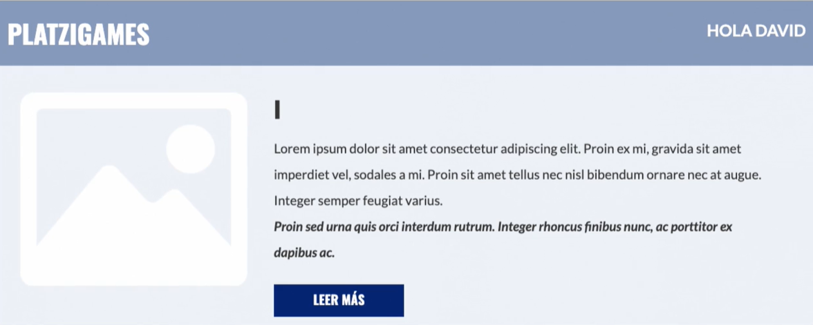

La denominación de *loop* hace referencia a **la repetición de una operación un numero de veces**. Pug nos brinda la posibilidad de generar loops con código de HTML, nos puede ayudar cuando tenemos elementos que debemos repetir con contenido distinto, por ejemplo las listas, menus, tablas, cards, entre otros.

## Declaración de un Loop

La manera de declarar un loop es a traves de `each` seguido de una variable que deseamos iterar, por ejemplo si queremos generar una lista `ul` cada uno de sus items `li`, podemos generarlos con un loop siguiendo un array que contenga el texto de cada item, entonces en Pug usariamos la siguiente sintaxis.

```pug
-var titulos = ['Titulo Principal','Subtitulo 1','Subtitulo 2','Subtitulo 3']
ul
    each titulo in titulos
        li=titulo
```

Que sera equivalente a decir en HTML:

```html
<ul>
  <li>Titulo Principal</li>
  <li>Subtitulo 1</li>
  <li>Subtitulo 2</li>
  <li>Subtitulo 3</li>
</ul>
```

## Condicionales

En los lenguajes de programación, los condicionales nos ayudan a tomar decisiones de acuerdo a una condición. Pug nos brinda esta ayuda al trabajar con HTML. Por ejemplo en las páginas de login, usualmente tenemos unos botones para usuarios que no estan suscritos y otros botones para usuarios que estan suscritos. A traves de los condicionales podemos generar la visibilidad de cada uno de los botones de acuerdo a los usuarios.

Haremos uso de un condicional para mostrar un mensaje de saludo a un usuario que estuviese suscrito y un boton de registro a un usuario que no este suscrito. Entonces en Pug seria:

```pug
-var usuario = 'David'
if usuario
    a Hola #{usuario}
else
    a.boton Registro
```

El resultado si el usuario esta suscrito sera:



El Resultado si es que el usuario no esta suscrito:


A través de esto nos ahorramos de generar dos paginas `.html` y únicamente generamos un archivo `.pug` con la condicional. Por lo tanto observamos que nuestro pseudocodigo generado por Pug, evoluciona a una forma de trabajar mas optima y limpia de generar paginas `.html`.

**Contribución realizada por:** David Castillo
