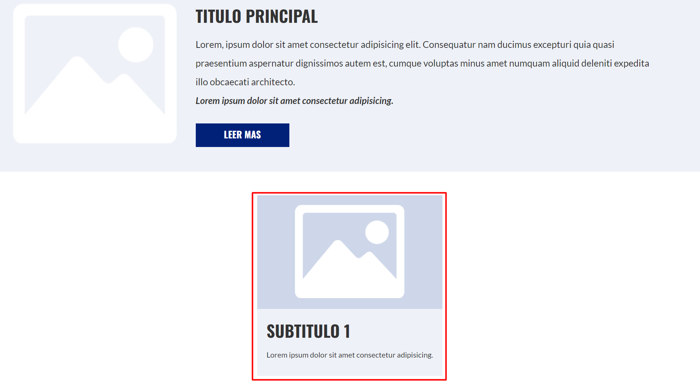
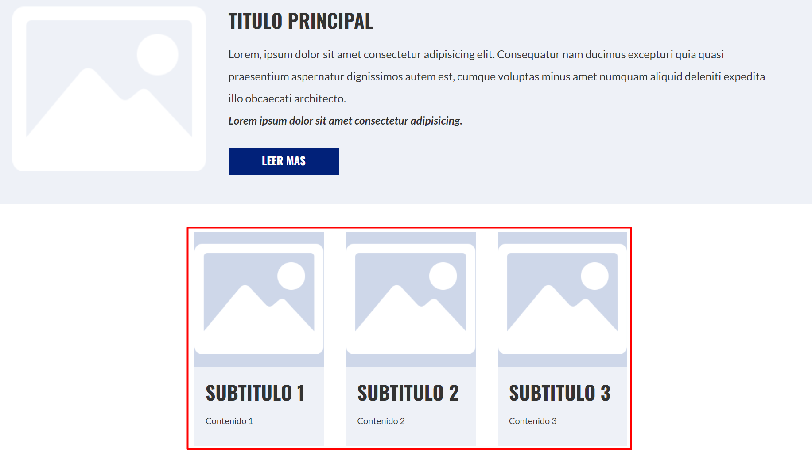

Los **mixins** son una especie de variables donde podemos almacenar estructuras completas de pug, que podemos reusar mas adelante cambiando su contenido a través de parámetros.

Para comprender de mejor manera los mixins comencemos definiendo una caja con estilos predeterminados.

```pug
main.contenido
    .caja
      .caja__imagen: img(src="images/imagen.png")
      .caja__contenido
        h3  #{titulos[1]}
        p Lorem ipsum dolor sit amet
```

El resultado sera:



Pues ahora si deseáramos generar 3 cajas seguir la misma sintaxis cambiando el contenido.

```pug
main.contenido
    .caja
      .caja__imagen: img(src="images/imagen.png")
      .caja__contenido
        h3  #{titulos[1]}
        p Lorem ipsum dolor sit amet
    .caja
      .caja__imagen: img(src="images/imagen.png")
      .caja__conteido
        h3  #{titulos[2]}
        p Lorem ipsum dolor sit amet
    .caja
      .caja__imagen: img(src="images/imagen.png")
      .caja__contenido
        h3  #{titulos[3]}
        p Lorem ipsum dolor sit amet
```



Pues bien, esto no parece ser lo mas ideal, ademas ya aprendimos las variables y los loops, y posiblemente podríamos hacer una sintaxis mas corta y legible con estas herramientas. Pero con los **mixins** nos permite encapsular toda el `div` de la caja y realizar los cambios que pensemos pertinentes.

### Declarar un Mixin

Para declarar un mixin, tenemos que ir a la parte superior de nuestro archivo `.pug` (antes de `doctype`) y colocar la palabra `mixin`, después un salto de linea y una indentación colocaremos el código que deseamos reusar mas adelante a través de una llamada al mixin.

```pug
mixin caja
    .caja
        .caja__imagen: img(src="images/imagen.png")
        .caja__contenido
            h3  #{titulos[1]}
            p Lorem ipsum dolor sit amet
```

Para llamar a este mixin utilizamos el signo de suma `+` y colocamos el nombre del mixin.

```pug
+caja
```

De esta manera obtendremos  una caja de igual forma como la obtuvimos anteriormente. 

## Enviar parámetros a un mixin

Si deseamos crear tres cajas con diferente contenido, entonces **podemos enviar parámetros a nuestro mixin**, con las características de cada caja. Encontces:

```pug
mixin caja(imagen,titulo,contenido)
    .caja
        .caja__imagen: img(src="images/"+imagen)
        .caja__contenido
            h3=titulo
            p=contenido
```

Para llamar a nuestro mixin con nuestros parametros personalizados sera:

```pug
+caja("imagen.png",titulos[1],"Contenido 1")
+caja("imagen.png",titulos[2],"Contenido 2")
+caja("imagen.png",titulos[3],"Contenido 3")
```

El resultado sera:


## Uso de Loops con un Mixin

Si deseas acortar y hacer mas corto tu código podemos hacer uso de los Loops, iterando el array de titulos:

```pug
each titulo in titulos
    +caja("imagen",titulo,"Lorem impsum")
```

El resultado sera el mismo de las 3 cajas renderizadas por el navegador.

**Contribución realizada por:** David Castillo
