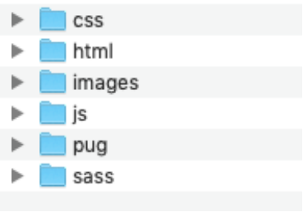

Al realizar la codificación de algún proyecto de Website o una Webapp, este debe lucir como si una sola persona lo haya escrito. Al trabajar con un equipo de desarrolladores es importante tomar una metodología de codificación y tener guías de creación y mantenimiento del código. 

A través de las guías se tendrá una consistencia entre la codificación, y todos los miembros del equipo van a lograr entender como es el funcionamiento del código que genera cada uno de ellos. 

Las guías de código nacen desde las tecnología que se están usando, las buenas practicas en la códificación, los manuales y métricas para una mejor legibilidad y performance del código.


## Recomendaciones Básicas en las guías de código

- Definir una identación a la hora de generar código, a través de la definición de identación lograremos una consistencia entre elementos padre, hijo, herencia entre otras .

- Consistencia con el uso de espacios, corchetes, puntos y comas.

- Definición de uso de números, selectores y divisiones.

- Agrupaciones de propiedades CSS, de acuerdo a la importancia y estructura de un box model.

- Uso de selectores css, con Id's, clases, psudoselectores, psudoelementos, entre otros.

## Guia de Código en el Proyecto

Esta guia se usara para la creación de la página de Platzi Games.

### Principios

+ Mantenerlo simple y reusar lo mas posible.

+ Un código que luzca como si una sola persona lo haya escrito

+ Escribir para escalabilidad.

### Estructura

  

### Generales

+ Usamos BEM como metodología de creación de código.
+ Nombre de archivos en plural (Ejemplo: _botones.scss)
+ Clases en singular y minúsculas (Ejemplo: .galeria__boton)
+ Nombrar imágenes relativas a su bloque. (Ejemplo: icono-busqueda.png)

### Sintaxis

+ 1 espacio después del selector y antes de {}
+ 2 espacios para indentación.
+ 1 espacio después del :
+ Bloques de CSS separados por 2 líneas
+ Evitar abuso de anidaciones. Limite 1 nivel
+ Mixins para tamaño, estilos y valores numéricos de fuentes.

### Manejo de Propiedades

Propiedades y selectores deben ordenarse de la siguiente forma:

1. Propiedades del modelo de caja (display, width, height, margin, etc)
2. Posicionamiento (position, left, top, right, etc)
3. Tipografía(text-transform, text-decoration)
4. Decoración (background-image, color, etc)
5. Variables
6. Mixins

```css
.button {
  display: block;
  width: 220px;
  height: 40px;
  position: relative;
  text-transform: uppercase;
  background-color: #333333;
  font-weight: $semibold;
  @include font-size (13px);
}
```

## Mas acerca de la guias de código.

Si quisieras generar estandares de desarrollo, recuerda que algunos estandares ya han sido generados y lo usan muchas empresas de acuerdo a sus criterios y necesidades. Los siguiente enlaces son otras guias con las cuales puedes seguir para generar codigo mas consistente entre tu equipo.

- https://codeguide.co/ 
- [Cómo perder peso (en el navegador)](https://browserdiet.com/es/)
- [Pautas de Accesibilidad para el Contenido Web (WCAG) 2.0](http://www.sidar.org/traducciones/wcag20/es/)
- [Quick start / Methodology / BEM](https://en.bem.info/methodology/quick-start/)
- [Curso de Sistemas de Diseño](https://platzi.com/cursos/sistemas-diseno/)


