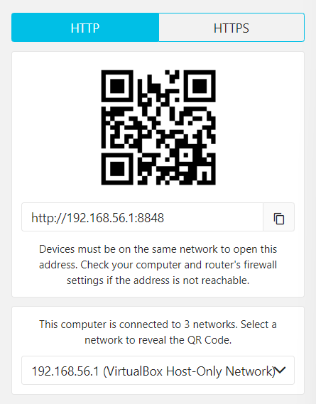

El editor de código que por excelencia se usa en la gran mayoria de productos de desarrollo web es [Visual Studio Code](https://code.visualstudio.com/), ya sea por sus extensiones, soporte, y herramientas para el uso de preprocesadores. 

Ahora para realizar la compilación (transformación de código generado en el preprocesador a CSS o HTML nativo), se puede hacer uso de una interfaz gráfica, como también se puede usar la linea de comandos para realizar la ejecución.

## Compilador para Preprocesadores

Los compiladores que tienen una interfaz grafica seran de ayuda a la hora de transformar el pseudocodigo al codigo nativo de HTML y CSS. Estos compiladores nos ayudaran a enforcarnos mas en el código y no estar tanto en la terminal. Entre las termonales mas usadas se encuentran:

- **[Codekit](https://codekitapp.com/):** Es un compilador de preprocesadores, y este tiene soporte para MacOS.

- **[Prepros](https://prepros.io/):** Es un compilador de preprocesadores multiplaforma, tiene una versión de prueba (actualizado en Agosto del 2022).

## Estructura de Archivo en Prepros

Al iniciar Prepros tendremos que cargar la carpeta de nuestro proyecto, luego veremos una pantalla donde a lado izquierdo se encuentra nuestras carpetas de los proyectos, al centro se encontraran un menu de pantallas con los siguientes elementos: 

- Las carpetas contenedoras **📁 Files**

- El administrador de errores **🪶Logs**, este nos indicara si existen errores en la codificación, así como la linea de código donde se encuentra el error.

- Un gestor de carga de archivos a la nube **☁️ Upload**, esto a traves de un servidor FTP o SFTP.

- Un buscador de paquete NPM 📦**Packages**, que nos sera útil si queremos ver el estado de un paquete en especifico del registro de paquetes NPM.

Otra ventaja que tiene el usar Prepros, es que genera un servidor local para realizar cambios de maquetación en tiempo real.

Tambien se puede realizar configuraciones a servidores externos utilizando conexiones por XAMPP, WAMP, MAMP, WordPress, Node,js entre otros.

Inclusive puedes utilizar tu red local para la previsualización de la maquetación, a través de una dirección de IP en la red local o un codigo QR generado. Asi puedes observar la maquetación de tu proyecto a traves de cualquier dispositivo externo ya sea en un telefono, tablet, notebook o computador de escritorio.

## Alternativas a Prepros y CodeKit

Una alternativa a los preprocesadores, es utilizar la linea de comandos y usar los CLI de cada uno de los distintos preprocesadores, también otra alternativa es usar las extensiones que existen en los editores de código, por ejemplo para Visual Studio Code puedes utilizar [Compile Hero Pro](https://marketplace.visualstudio.com/items?itemName=Wscats.eno), que permite compilar tanto en preprocesadores como Sass, Less, Stylus, Pug, Jade y TypeScript.

Te dejo un enlace de una lista de compiladores de preprocesadores, donde se encuentran algunos de pago y otros gratuitos dependiendo del preprocesador que se utilice. 

[Compilers CSS PREprocessors](https://csspre.com/compile/) 

**Contribución realizada por:** David Castillo
